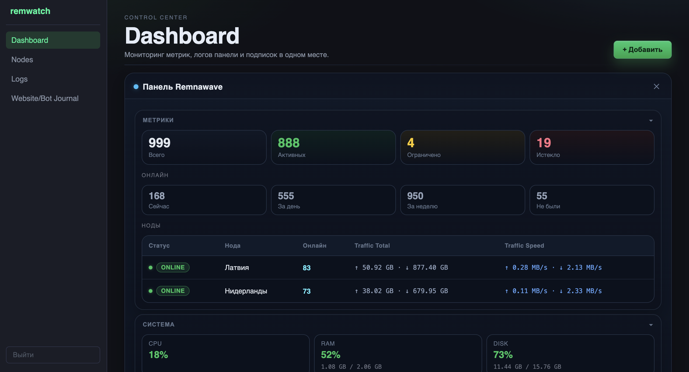
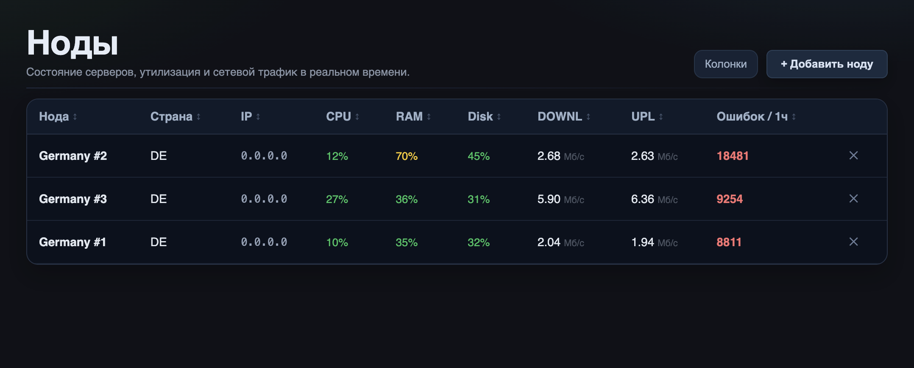
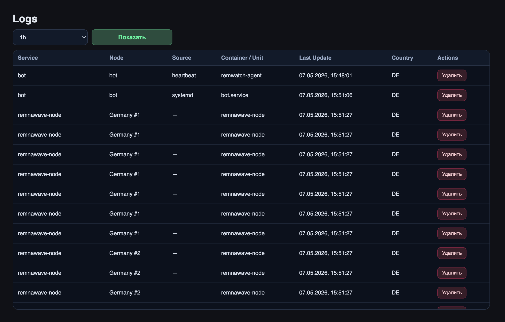
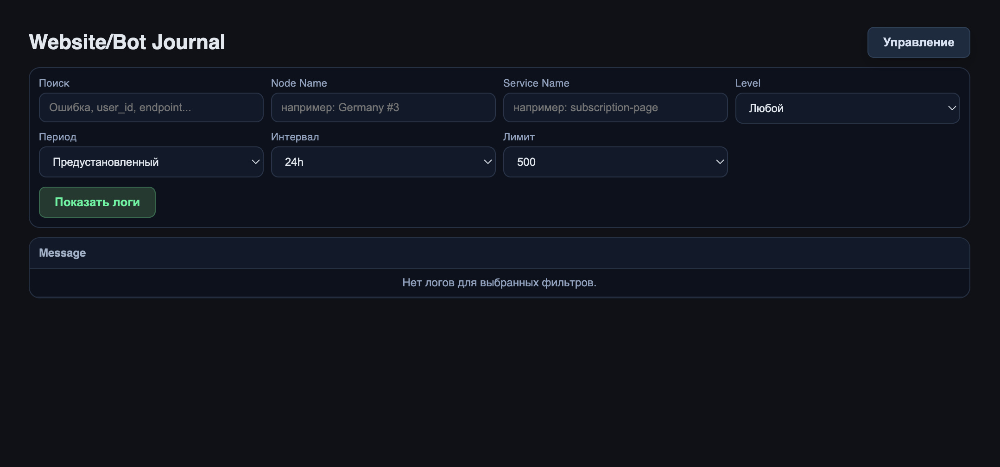

# remwatch

`remwatch` — панель мониторинга нод и сервисных логов (Loki).

> Важно: панель находится на ранней стадии разработки (early stage / WIP). Настоятельно не рекомендую ставить его на прод.

## Возможности

- **Dashboard** — общий обзор метрик, состояния нод, пользователей и трафика.
- **Nodes** — список нод, статусы, сетевые показатели и добавление новых нод.
- **Logs** — список источников логов в Loki, время последнего обновления и удаление источников.
- **Website/Bot Journal** — поиск по логам сайта/бота с фильтрами по сервису, уровню и периоду.

## Скриншоты

### Dashboard

### Nodes

### Logs

### Website/Bot Journal

